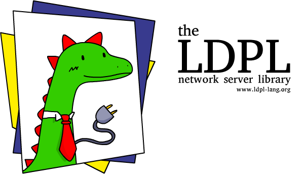

The **LDPL Network Server Library** is an library for creating socket based servers in
[**LDPL**](https://www.github.com/lartu/ldpl). It aims to make it very easy to develop,
test and deploy network servers, with as little work as possible. This library requires
**LDPL 4.3** or greater.

## 🖼️ Example

The [Lute](https://github.com/lartu/lute) text editor was written using this library.


## 🧰 Installation

Include the library into your LDPL project by copying the folder *ldpl-ncurses* to your project directory and then adding the line:

```coffeescript
include "ldpl-ncurses/ldpl-ncurses.ldpl"
```

before the `data` and `procedure` sections of your source file. The library is
ready to be used.

## 📚 Documentation

This library adds five new statements to the language:
- `NET LISTEN ON <number>`
   - Use this statement to start your server on port number `<number>`. Do this after
   you've written all our code and set up the whole library, as this is a locking
   statement and anything after it won't be executed (because your server will be too
   busy listening for new data and connections).
- `NET START ON <number>`
   - Use this statement to start your server on port number `<number>` without blocking
   the execution of your program. You will need to use `NET POLL` to listen for client
   activity. When your program exits, the socket is closed.
- `NET POLL`
   - Use this statement to listen for client activity when your server has been started
   using `NET START ON <number>`.
- `NET SEND <text> TO <socket number>`
   - Use this statement send the message `<text>` to the client identified by the
   socket number `<socket number>`. The client will receive your message, easy as pie.
- `NET KICK CLIENT <socket number>`
   - Use this statement to disconnect the client identified by the socket number `<socket number>`.
   
In order to work, the library requires you to declare three sub-procedures:

### `net_new_client`

This sub-procedure will be called when a new client connects to your server. When called,
it will receive three values: a `socket_number` identifying your client (you may want to
store this value somewhere), the `ip` of the connecting client and its `port`.

```coffeescript
sub net_new_client
    parameters:
        socket_number is number
        ip is text
        port is number
    procedure:
        # Your code goes here
end sub
```

### `net_client_left`

This sub-procedure will be called when a client that was connected to our server closes
the connection and disconnects. When called, it will receive three values: a `socket_number`
identifying the client that left, the `ip` of the disconnecting client and its `port`.

```coffeescript
sub net_client_left
    parameters:
        socket_number is number
        ip is text
        port is number
    procedure:
        # Your code goes here
end sub
```


### `net_new_message`

This sub-procedure will be called whenever a connected client sends a message to our server.
When called, it will receive two values: a `socket_number` identifying the client that sent
the message and the `message` itself.

```coffeescript
sub net_new_message
    parameters:
        socket_number is number
        message is text
    procedure:
        # Your code goes here
end sub
```

## :book: Template

A simple template for a minimal echo server can be found in the *net_template.ldpl* file.
Be sure to check it if you have any doubts about where to start writing your server.

## :scroll: License

This library is released under the MIT License.
